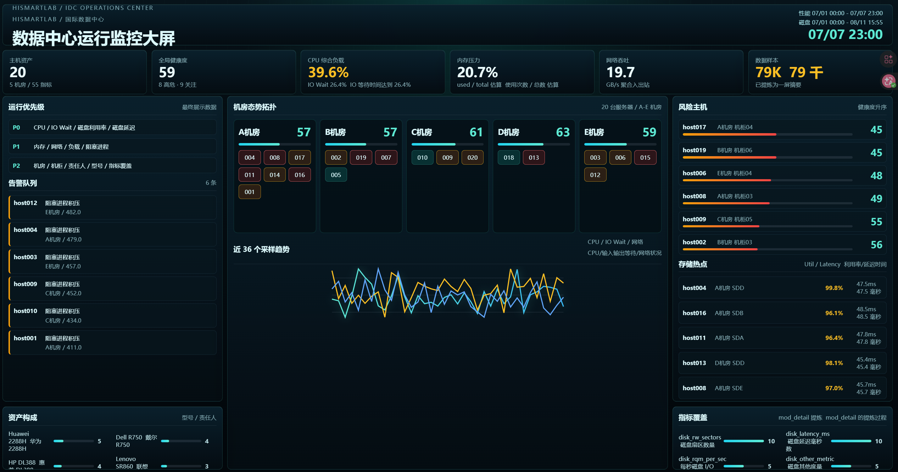

# ComputerRoomScreen

数据中心运行监控大屏，使用 Vue 3 + TypeScript + Vite 实现。

## 效果预览



## 功能

- 从 `host_detail.dat`、`mod_detail.dat`、`pref_tsar.dat`、`disk_tsar.dat` 提炼最终展示数据
- 单屏展示主机资产、全局健康度、机房态势、风险主机、告警队列、性能趋势、存储热点、资产构成和指标覆盖
- 构建时生成轻量摘要数据，避免浏览器打包全量原始时序

## 使用

```bash
npm install
npm run dev
```

生产构建：

```bash
npm run build
```
